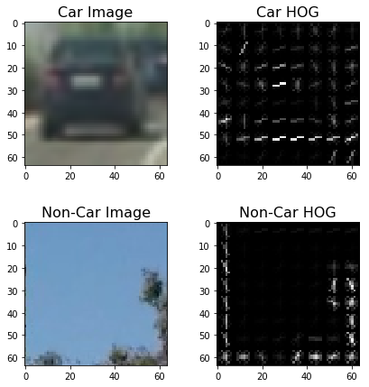
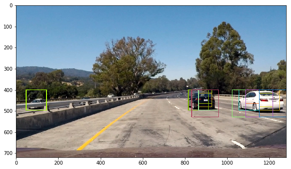
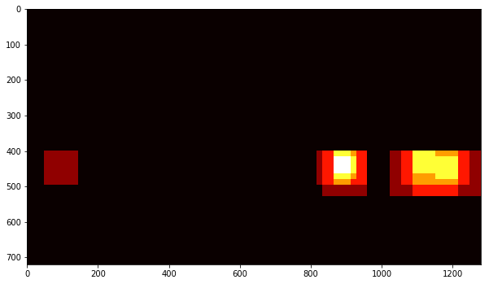
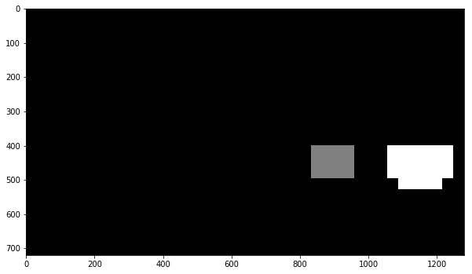
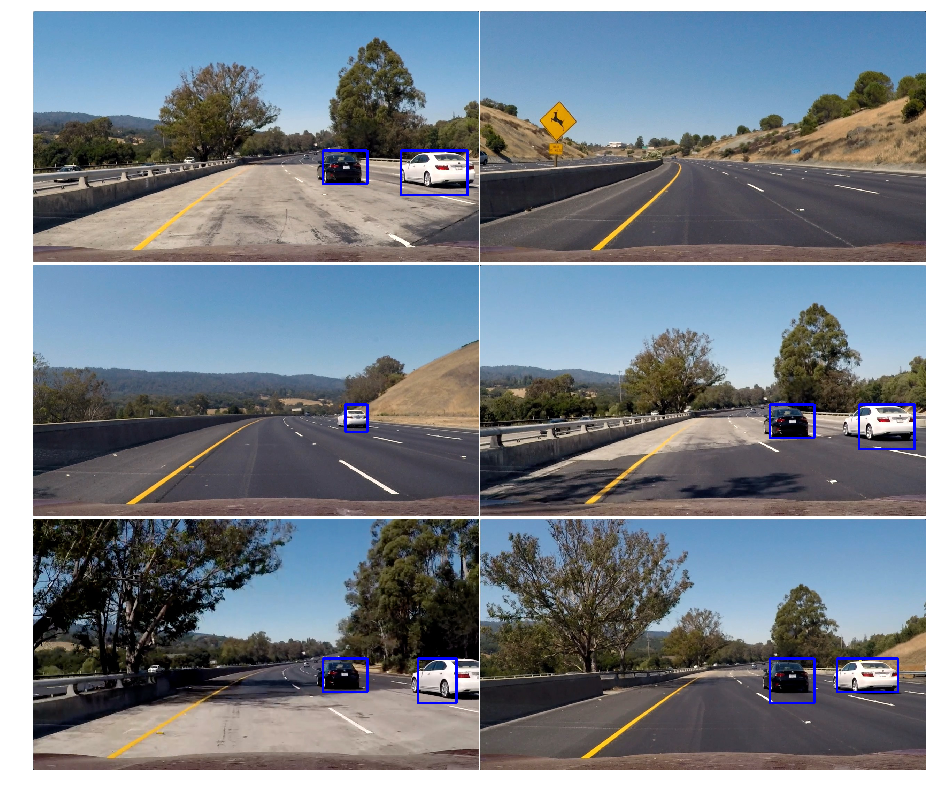

**Vehicle Detection Project**

The goals / steps of this project are the following:

* Perform a Histogram of Oriented Gradients (HOG) feature extraction on a labeled training set of images and train a classifier Linear SVM classifier
* Normalize the features and randomize a selection for training and testing.
* Implement a sliding-window technique and use the trained classifier to search for vehicles in images.
* Run the image and video pipeline on a video stream (start with the test_video.mp4 and later implement on full project_video.mp4) and create a heat map of recurring detections frame by frame to reject outliers and follow detected vehicles.
* Estimate a bounding box for vehicles detected.

###Histogram of Oriented Gradients (HOG)

####1. Extracting HOG features from the training images and HOG Parameters.

The code for this step is contained in the first code cell of the IPython notebook .  

I started by reading in all the `vehicle` and `non-vehicle` images.  I then explored different color spaces and different `skimage.hog()` parameters (`orientations`, `pixels_per_cell`, and `cells_per_block`).  I grabbed random images from each of the two classes and displayed them to get a feel for what the `skimage.hog()` output looks like.
I tried various combinations of parameters and finally used the `YUV` color space and HOG parameters of `orientations=11`, `pixels_per_cell=(16, 16)` and `cells_per_block=(2, 2)`
Here is an example of one of each of the `vehicle` and `non-vehicle` classes. 

####2. Training a classifier using my selected HOG features (and color features).

I trained a linear SVM using parameters mentioned above.

###Sliding Window Search

####1. Implementing a sliding window search (Decide what scales to search and how much to overlap windows)

I decided to search window positionsall over the image:

####2. Examples of test images (optimizing the performance of my classifier)

Ultimately I searched on various scales using YUV 3-channel HOG features plus spatially binned color and histograms of color in the feature vector by combining Various Sliding Window Searches, which provided a nice result.  Here are some example images:

---

####3. Implementing filter for false positives and method for combining overlapping bounding boxes.

I recorded the positions of positive detections in each frame of the video.  From the positive detections I created a heatmap and then thresholded that map to identify vehicle positions.  I then used `scipy.ndimage.measurements.label()` to identify individual blobs in the heatmap.  I then assumed each blob corresponded to a vehicle.  I constructed bounding boxes to cover the area of each blob detected.  

Here's an example result showing the heatmap from a series of frames of video, the result of `scipy.ndimage.measurements.label()` and the bounding boxes then overlaid on the last frame of video:

Here is the corresponding heatmaps:

Here is the output of `scipy.ndimage.measurements.label()` on the integrated heatmap from the test image:

Here the resulting bounding boxes are drawn from all test images:

### Video Implementation

####1. Store information

Because the sliding windows are changing sizes on the test images, there is one class added to save information from previous frame in the pipeline so that the detection on the video is more consistent in each frame of the video.
My pipeline performs reasonably well on the entire project video (somewhat wobbly or unstable bounding boxes but identifying the vehicles most of the time with minimal false positives.)

Here's a [link to my video result](./project_video.mp4)

###Discussion
####1. Problems / issues  
When the car emerges from the field of view, there are short periods that cars are not detected at the first time. When two cars appeared side by side, there are single detection rather than two detections. There is still one false positve.

I think the problems come from less datasets. If time allowed, augmenting data can be implmented to improve prediction. Other steps can be considered too, such as choice of feature vector, thresholding the decision function, hard negative mining etc. 

 

